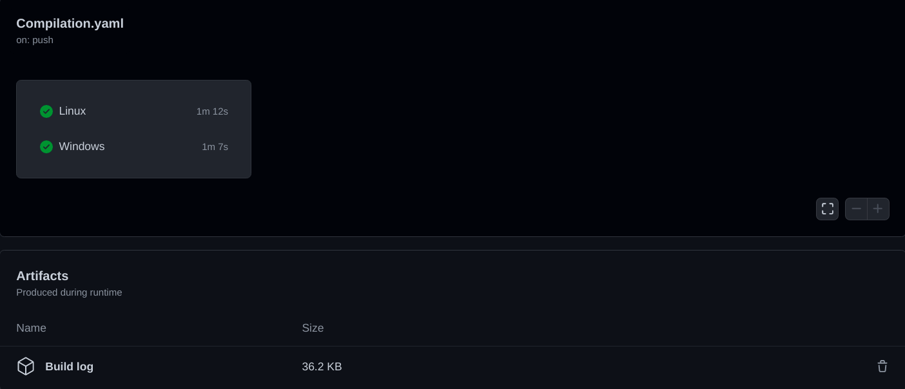
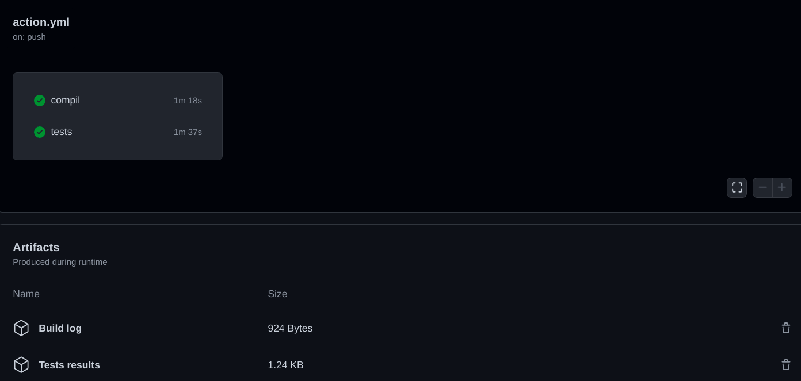
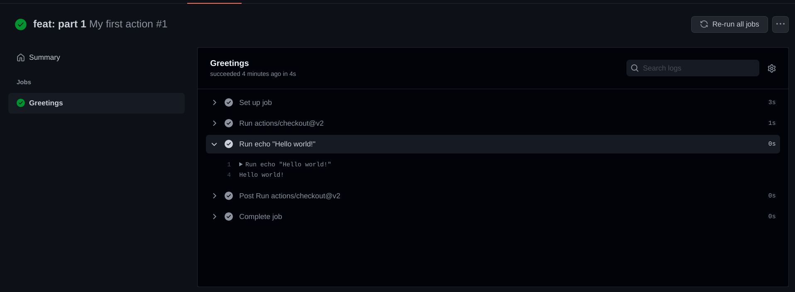
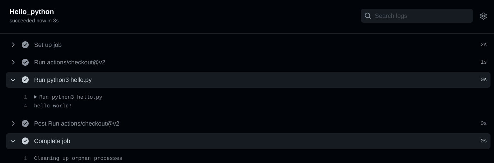
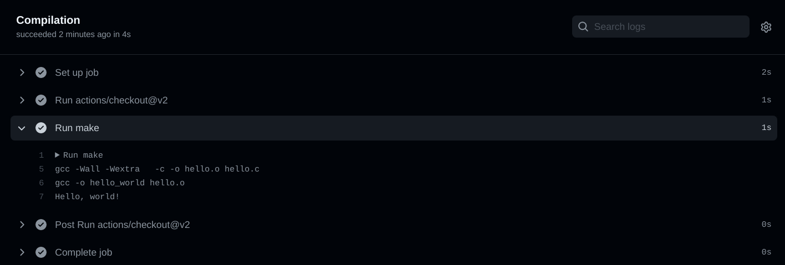
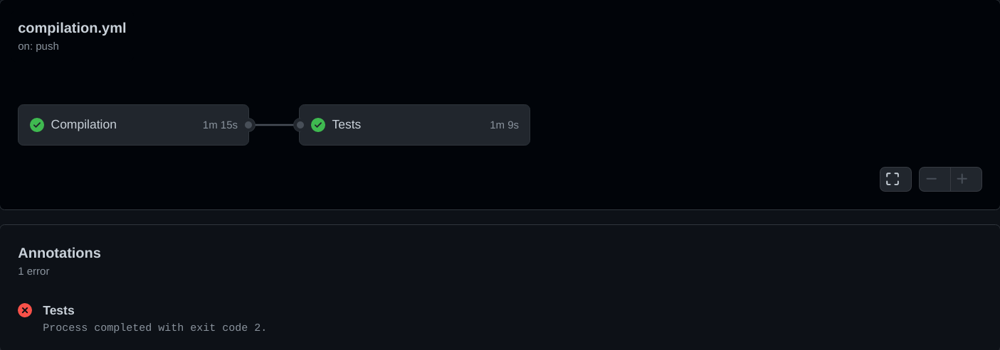
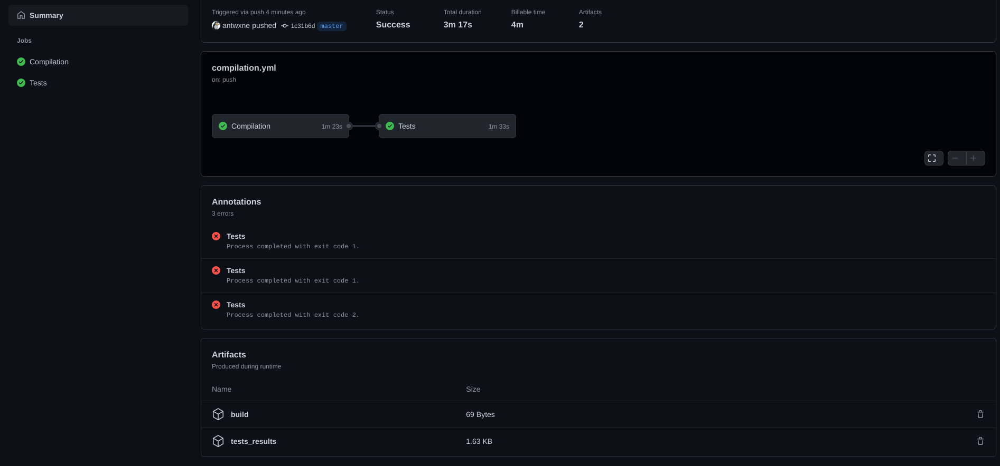

# Workshop GitHub action 

## Introduction

The github actions allow you to launch a series of actions during an event on a github directory.

Like for example checking if the project compiles well, or even launching a battery of tests on the project.





During this workshop you will see how to make a workflow that checks that the project compiles correctly and also run tests on the project.

## First step

### Discovery

In this part you will familiarize yourself with how to write github actions.
To start you must have a file ending in `.yml` located in a `.github/workflows` folder.

```shell
$> ls .github/workflows/
action.yml
```

Using the [github actions](https://docs.github.com/en/actions) and [workflows](https://docs.github.com/en/actions/learn-github-actions/workflow-syntax-for-github-actions) create an action that:

- Is called `My first action`.
- Launches when pushing to the `master` branch.
- Has a `job` called `Greetings`.
   - Runs on the latest version of Ubuntu
   - This job must use `actions/checkout@v2` and display `Hello world!` in the console.

Push your changes to the master branch.

You should have the following result:


# If everything works you can now add some commands in your action.

In the same job as before.

In the same `run` as the previous part:
- Create a `Plop` folder
- List all files in the directory and put the output in a file.
- Move this file to the `Plop` folder.
- List the files in located in `Plop`.


#### Something other than Linux to launch its actions

The github actions allow you to launch actions on different operating systems.
This is what we are going to see now.

Create a new `.yml` file in `.github/workflows`

This workflow should have the following characteristics:
- Be called `Multi OS`
- Launches when pushing to the `master` branch.
- Do not launch if the commit contains `[skip ci]`.
- Has a `job` called `WinduntuOS`:
  - Running on the latest versions of Ubuntu, Windows and MacOs.
  - displaying `Hello from <bone name>` in the console.

> For this part look at what a `matrix` is.

## Run a program

For this part you will need to run the `hello.py` script, which is located in `app/python`.

> You will launch the script with the following command `python3 hello.py`.

Create a new `Jobs` in `action.yml`.

You will call this jobs `Hello_python` and it will have the following characteristics:

- Launch during a push
- Run on `ubuntu_latest`
- Use `actions/checkout@v2`
- Run the python script

You should have the following result:



# Compile

Now that you're a little more comfortable with github actions, you'll see how you can use them for your projects.

Start by creating a new `compilation.yml` file.

### Easy compiling

You can find in `app/c` a `Makefile` which compiles a program named `hello_world`.

In this part, you will compile the project and run it.

In the `compilation.yml` file create a new `Workflow` named `Compilation`.

This workflow should:

- Launch during a `push` on any branch. And be skipped when the commit contains `[skip ci]`.
- Run on a `pull request` on the `master` branch.
- Have a `jobs` named `Compilation`.
- Launch on `ubuntu_latest`.
- Use `actions/checkout@v2`.
- Do `make` and run your program.

You should have the following result:



### Containerized build

Now that you have successfully compiled your program, you will have to compile it in a particular environment.

To do this we will use _Docker_, as well as the image used by the mill.
Thus you will be able to check that your program works well under the same conditions as those of the tests.

Reuse the previous job and make it use the `epitechcontent/epitest-docker` image.

Then compile and run the program.

## Testing

Knowing if your program compiles and runs is one thing, knowing if it does what is expected is another.

This is why you are going to run tests on the project.

### Unit tests

Still in the `compilation.yml` file, create a new job called `Tests`.

This job will:
- Launch on `ubuntu_latest`.
- Use the mill docker image.
- Run `only if the COMPILATION job was successful`.
- Do `make tests_run` in the `app/c` folder.

As you can see, when a test fails, the action is marked as `failed`.

To correct this, add an option in your step, to continue even if the step fails.

You should have the following result:



### Functional testing

In the previous part you ran tests from a `Makefile`.
But nothing prevents you from doing tests from a script (bash for example).

Add a `step` in the `job` tests, this step:
- Will run your script.
- Timeout after 2 minutes (to avoid infinite loops).

## Artifacts

`Artifacts` are used to store files created during a job.

You will find the documentation [here](https://docs.github.com/en/actions/advanced-guides/storing-workflow-data-as-artifacts).

In your case you will use it to make log files for the `compilation` and for the `tests`.

From the `Compilation` workflow, make artifacts for:
- The compilation.
- Unit tests and Functional tests which contains:
  - Test results.
  - The results of the coverage

At the end you should have the following result:



> Be careful, `make tests run` also runs the tests but with a colored output.
> You have to run the tests with `--ascii` to remove the color.

## Contributors

- Louis PIOCHAUD 
- Antoine GAVIRA BOTTARI 


<!-- Markdown link & img definition's -->

[Github-logo]: https://img.shields.io/badge/GitHub-100000?style=for-the-badge&logo=github&logoColor=white⏎ 
